# スピアフィッシグ用手銛 / spear-fishing gear

## 概要 / What's this?
スピアフィッシング用機材に関するコラムです。  
ジョイント金具の図面をSVGで置いてあります。  
This is a column of spear-fishing gear.  
Blueplints of joint components are available in SVG Format.

## 必要な材料 / materials required
- ステンレスのジョイント金具（後述） / Joints made from stailess steel (described bellow) 
- 10mmカーボン丸棒またはカーボンパイプ / 10mm solid bar of carbon fiber or pipe of carbon fiber
- 以下のような、銛先。市販品。 / Spear heads like below. You can buy one on market, in Japan.
    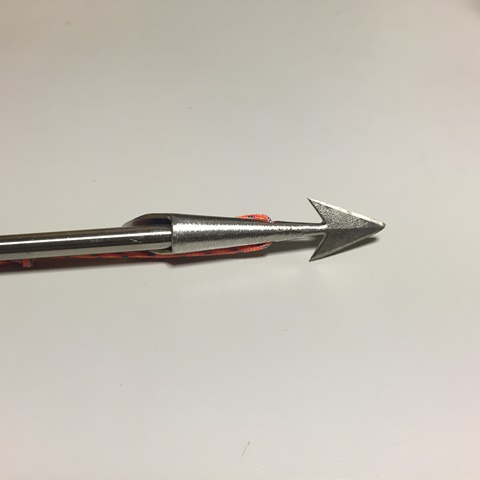

## 図面 / Blueprints

### ジョイント金具 / Joints
|(A)|(B)|(C)|(D)|
|:---------:|:-----------------:|:--------:|:-:|
|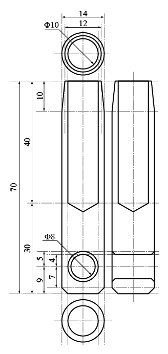|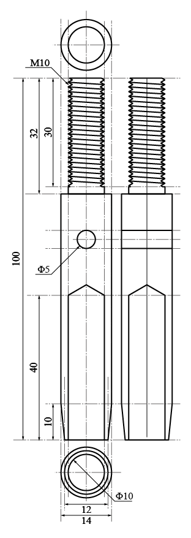|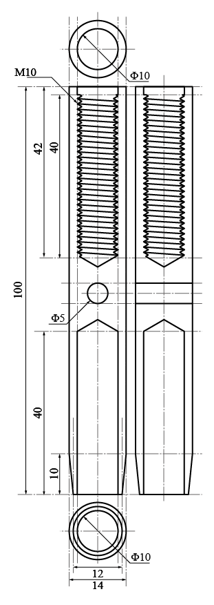|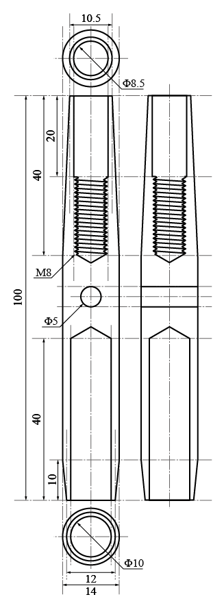|
紐を結ぶ、石突き ferrule to tie strings|雄ねじ付きジョイント joint with male screw|雌ねじ付きジョイント joint with female screw|銛先押し棒用ジョイント joint of spear head holder|
|[SVG](./svgs/A.svg)|[SVG](./svgs/B.svg)|[SVG](./svgs/C.svg)|[SVG](./svgs/D.svg)|

### (E) 銛先押し棒 / Spear head holder
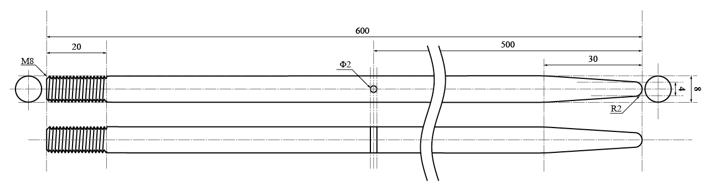  
[SVG](./svgs/E.svg)

端点に銛先をホールドします。  
This holds spear head at the endpoint.

### (F) torque tool
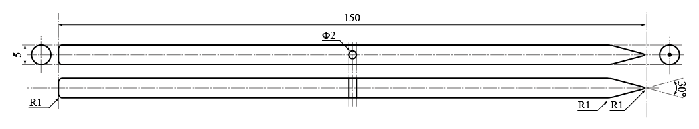  
[SVG](./svgs/F.svg)

固着したジョイント金具のネジを回すためのトルクバーです。  
This is extension bar to boost torque to screw fixed joints.

## 全ての図面をpdf形式でダウンロード / All in one pdf
[PDF](./pdfs/blueprint.pdf)

## 組み立て方 / How to assemble?
以下の順番で組み立てます。  
カーボンバーはお好きな長さで。  
Assembly should be ordered as below.  
Enlengthen carbon pipe (or solid bar) as you like.  

**(A)-CP-(B)-(C)-CP-(D)-(E)-SH**

CP : カーボン丸棒またはパイプ / Carbon pipe or solid bar  
SH : 銛先 / Spear head

## 組み立て写真 / Assembly photos
### (A)とカーボンパイプの接続 / (A) with carbon pipe

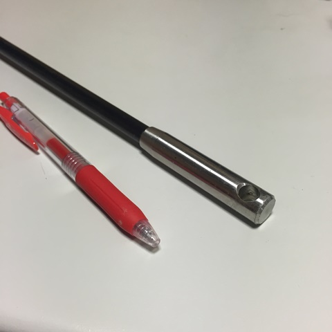

### (B)とカーボンパイプの接続 / (B) with carbon pipe

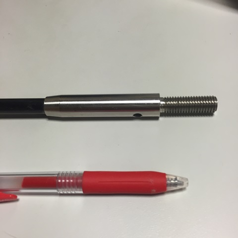

### (C)とカーボンパイプの接続 / (C) with carbon pipe

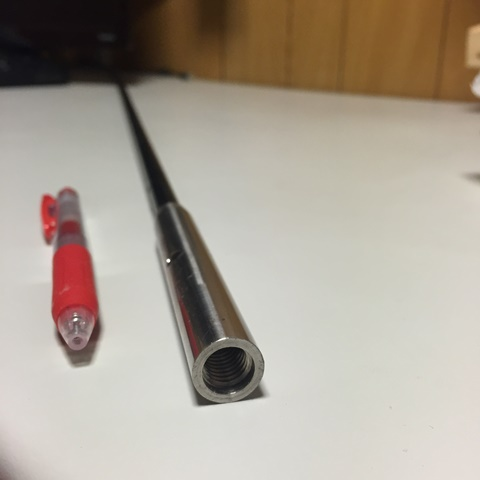

### (D)とカーボンパイプの接続 / (D) with carbon pipe

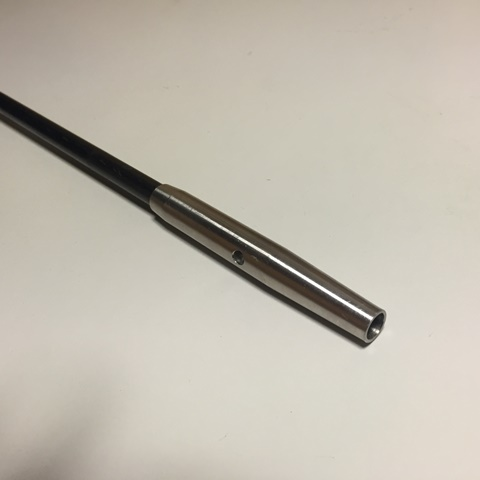

### (B)と(C)のネジ接続 / screwed (B) and (C)

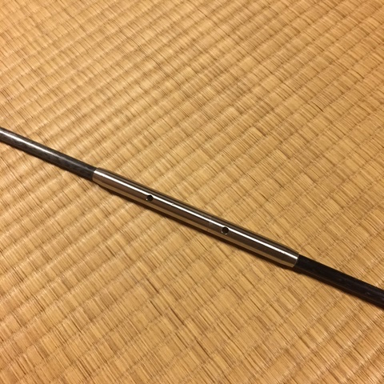

### 銛先ユニットと(E)の組み立て / assembly of (E) with spear head unit

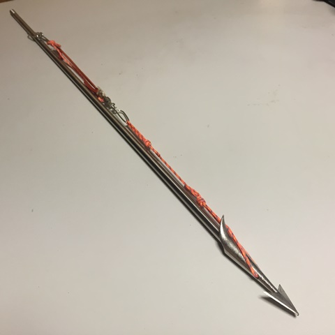

### (F)トルクバー / (F) torque bar

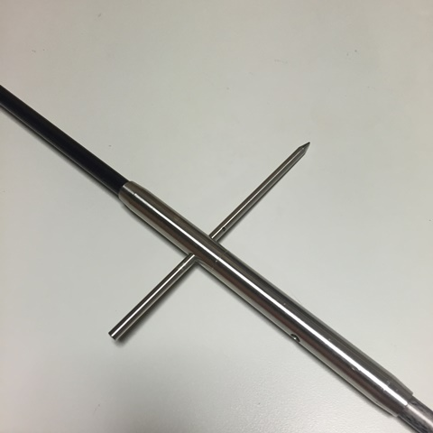

## 手銛の機能の解説 / how does it work?

1. 魚を突きます / Spear!

    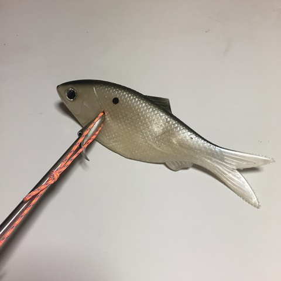

2. 魚が逃げ、銛先が外れます。 / The fish escapes and your spear head released.

    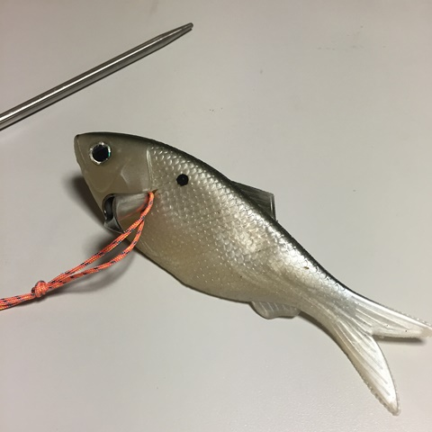

3. 魚の泳力を、ヒモが吸収してくれます。  
可能な限り手早く取り込みましょう。  
String absorbs strugle of the fish.  
Harvest it as soon as possible.

    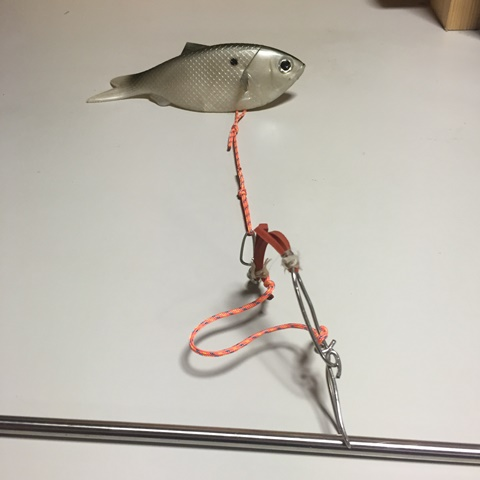

## なぜ水中銃を使わないか？ / Why not spear guns?
日本において、水中銃は各都道府県の漁業調整規則によって禁止漁具に指定されています。  
Spear guns are prohibited in Japan.

## ライセンス / License
 <a href= "https://github.com/KamataRyo/Columns/blob/master/spear-fishing%20gear/README.md">この作品</a>は <a rel="license" href="http://creativecommons.org/licenses/by/4.0/">クリエイティブ・コモンズ 表示 4.0 国際 ライセンスの下に提供されています。</a>